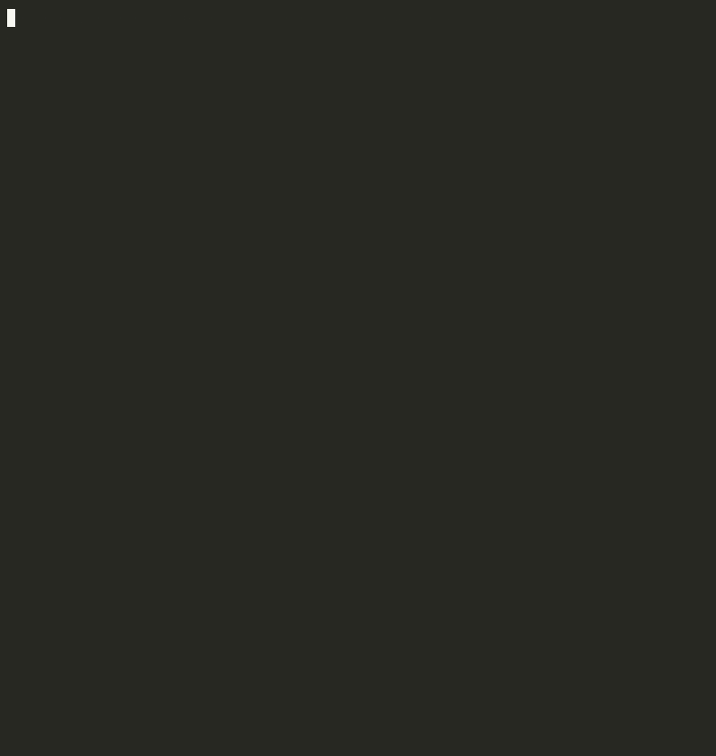

# SysGuard CLI

**Security auditing and hardening for Linux servers, straight from your terminal.**

> An interactive CLI that consolidates repetitive sysadmin tasks into a single
> workflow: firewall auditing, SSH intrusion analysis, and performance
> diagnostics following the USE methodology.

*Read this in [Español](README.es.md).*


<p align="center">
  
</p>

---

## The Problem It Solves

When you administer Linux servers, there are three questions you ask yourself every day:

1. **Is the firewall configured correctly?**
2. **Is someone trying to break in via SSH?**
3. **Is the system saturated or hiding silent errors?**

Answering them means running 5 to 8 different commands each time,
remembering log paths that change across distributions, and formatting
the output manually. **SysGuard consolidates all of that into a single
interactive CLI** with autocompletion, automatic init system detection,
and readable on-screen reports.

It's not a framework. It's not a suite. It's a sharp tool for a specific
job, built with the Unix philosophy: **do one thing and do it well.**

---

## What Does It Actually Do?

| Function | What It Audits | How |
|----------|---------------|-----|
| `check-firewall` | UFW firewall status | Queries `ufw status` and reports active rules |
| `analyze-logs` | Failed SSH authentication attempts | Reads logs based on the detected init system (runit, systemd, or syslog) |
| `metrics-use` | System performance | Applies the USE methodology: **U**tilization, **S**aturation, **E**rrors |

### Init System Detection

SysGuard automatically identifies whether the server runs **runit**, **systemd**,
or classic **syslog**, and adapts log reading accordingly. This makes it
portable across distributions like antiX (runit), Debian/Ubuntu (systemd),
or minimal installations using syslog.

---

## Demo

```
  ███████╗██╗   ██╗███████╗ ██████╗ ██╗   ██╗ █████╗ ██████╗ ██████╗
  ██╔════╝╚██╗ ██╔╝██╔════╝██╔════╝ ██║   ██║██╔══██╗██╔══██╗██╔══██╗
  ███████╗ ╚████╔╝ ███████╗██║  ███╗██║   ██║███████║██████╔╝██║  ██║
  ╚════██║  ╚██╔╝  ╚════██║██║   ██║██║   ██║██╔══██║██╔══██╗██║  ██║
  ███████║   ██║   ███████║╚██████╔╝╚██████╔╝██║  ██║██║  ██║██████╔╝
  ╚══════╝   ╚═╝   ╚══════╝ ╚═════╝  ╚═════╝ ╚═╝  ╚═╝╚═╝  ╚═╝╚═════╝

         Linux Security Auditing & Hardening  ·  v1.0

  ✓ Init detected: RUNIT
  ✓ Permissions: ROOT

============================================================
 SysGuard Interactive CLI - Press TAB to see commands
============================================================

sysguard > [TAB]
check-firewall  analyze-logs  metrics-use  exit
```

> On exit (`exit` or `Ctrl+C`), the terminal is fully restored with no
> visual trace left behind. Same behavior as `htop` or `vim`.

---

## Quick Start

### Prerequisites

- Linux with Python 3.12+
- Root privileges (required to read logs and query the firewall)

### Installation

```bash
git clone https://github.com/your-username/devops-showcase.git
cd devops-showcase/01-security-compliance

# Virtual environment (recommended)
python3 -m venv .venv
source .venv/bin/activate
pip install -r requirements.txt
```

### Usage

```bash
# Interactive mode (menu with autocompletion)
sudo python3 sysguard.py

# Flag mode (direct execution, ideal for scripts or cron jobs)
sudo python3 sysguard.py --check-firewall
sudo python3 sysguard.py --analyze-logs
sudo python3 sysguard.py --metrics-use
```

---

## Interactive Menu Options

| Command | Description |
|---------|-------------|
| `check-firewall` | Verifies UFW status and lists active rules |
| `analyze-logs` | Searches for failed SSH attempts in system logs |
| `metrics-use` | Performance diagnostics: disk, RAM, load, kernel errors |
| `exit` | Exits the CLI and restores the terminal |

Navigation: type the first few characters and press **TAB** to autocomplete.

---

## Bash Autocompletion

SysGuard includes native completion so flags work with TAB directly in your shell:

```bash
# Activate for the current session
source completions/sysguard-completion.sh

# Activate permanently
sudo cp completions/sysguard-completion.sh /etc/bash_completion.d/sysguard
```

After this, `sudo sysguard --<TAB>` will display all available options.

---

## Project Structure

```
01-security-compliance/
├── sysguard.py                  # Main CLI entry point
├── resources/                   # Visual resources package
│   ├── __init__.py
│   └── banner.py               # ASCII art, boot animation, alt screen
├── completions/                 # Shell integration artifacts
│   └── sysguard-completion.sh  # Bash autocompletion
├── requirements.txt             # Python dependencies
└── README.md
```

**Separation of concerns:**
- `resources/` contains only importable Python code (UI, presentation).
- `completions/` contains only shell artifacts (installation, OS integration).
- `sysguard.py` is the single entry point and concentrates all auditing logic.

---

## Design Decisions

| Decision | Rationale |
|----------|-----------|
| **Stdlib first** | `subprocess`, `os`, and `argparse` handle 90% of the work with zero external dependencies. Only `prompt_toolkit` is added for interactive UX. |
| **Init detection** | SSH logs live in different paths depending on the init system. Instead of hardcoding a path, SysGuard detects and adapts. Portable by design. |
| **Alternate screen buffer** | The terminal is restored on exit, just like `htop`. No residual scroll, no visual noise. Clean UX. |
| **USE methodology** | Instead of dumping raw metrics, data is structured under Utilization → Saturation → Errors. The operator reads conclusions, not raw data. |
| **Zero heavy dependencies** | The project runs on limited hardware (3 GB RAM, HDD). Every dependency must justify its existence or it doesn't get in. |

---

## CI / Code Quality

Every push to `main` automatically runs:

| Check | Tool | What It Validates |
|-------|------|-------------------|
| Python static analysis | `ruff` | Syntax errors, unused imports, undefined variables, basic security |
| Shell script linting | `shellcheck` | Errors and bad practices in `sysguard-completion.sh` |

> The pipeline is defined in `.github/workflows/` at the repository root.

---

## Roadmap

- [ ] JSON report export for integration with other systems
- [ ] Open port auditing module (`ss -tunlp`)
- [ ] `fail2ban-client` integration for active ban status
- [ ] Excel export support (executive report)
- [ ] Test suite with `pytest`

---

## Author

Built as part of the **[devops-showcase](../README.md)** portfolio —
a collection of DevOps tools designed to solve real infrastructure
problems with clean, maintainable code.