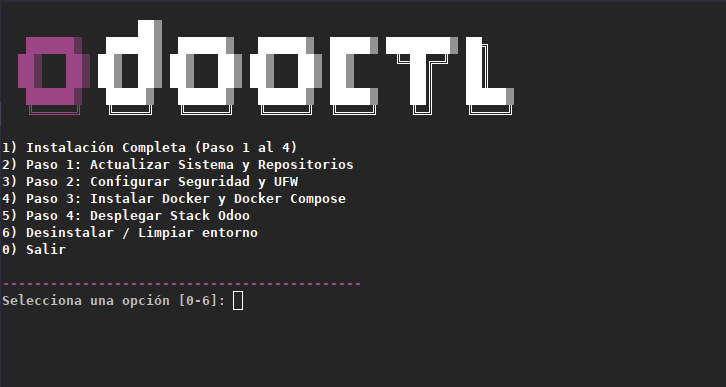

# odooctl / odoo-installer



**Instalación y despliegue automatizado y seguro de Odoo Community en servidores Linux.**

> Un instalador interactivo que convierte un despliegue ERP de múltiples pasos —
> paquetes del sistema, hardening del firewall, Docker Engine, proxy inverso,
> certificados SSL y el stack completo de Odoo + PostgreSQL — en un único flujo
> guiado. Incluye una vía con Ansible para despliegues remotos por SSH.

*Read this guide in [English](README.md).*


> ⚠️ **Proyecto en etapa temprana (v0.1.0-beta).** Esta herramienta está en
> desarrollo activo y puede presentar errores o comportamientos incompletos.
> Está diseñada para **Ubuntu Server** y requiere **privilegios de root**.
> Revisa el aviso que muestra el instalador antes de ejecutarlo en una máquina
> con datos valiosos — el desinstalador elimina contenedores, imágenes,
> volúmenes y reglas de firewall de forma permanente.

---

## El Problema Que Resuelve

Desplegar Odoo Community en un servidor limpio no es una tarea — es una cadena
de diez:

1. Actualizar el sistema e instalar paquetes base
2. Endurecer el firewall (UFW) — incluyendo la trampa que casi todos omiten:
   Docker saltándose silenciosamente las reglas de UFW
3. Instalar Docker Engine y Compose desde el repositorio oficial firmado
4. Escribir un `docker-compose.yml` para Odoo + PostgreSQL + Nginx
5. Generar un `.env` con credenciales de base de datos
6. Configurar Nginx como proxy inverso (HTTP + WebSocket)
7. Solicitar y cablear certificados de Let's Encrypt
8. Definir límites de recursos y healthchecks
9. Mantener los certificados renovados
10. Saber deshacer todo limpiamente

Hacerlo a mano es lento, fácil de equivocarse y distinto en cada servidor.
**odooctl consolida toda la cadena en un solo menú interactivo** — o en un
único playbook de Ansible cuando el destino es un host remoto.

No es un panel de control. No es un SaaS. Es una herramienta afilada para un
trabajo específico, construida con la filosofía Unix: **haz una sola cosa y
hazla bien.**

---

## ¿Qué Hace Realmente?

| Paso | Función | Qué hace |
|------|---------|----------|
| 1 | `scripts/01-install-tools.sh` | Actualiza repositorios, actualiza paquetes e instala herramientas base (`curl`, `git`, `gnupg`, etc.) |
| 2 | `scripts/02-firewall.sh` | Endurece UFW: políticas denegar por defecto, SSH con límite anti-fuerza bruta, puertos 80/443 y una cadena `DOCKER-USER` para que Docker no se salte el firewall |
| 3 | `scripts/03-docker.sh` | Instala Docker Engine + Compose desde el repositorio oficial usando un keyring GPG verificado |
| 4 | `scripts/04-deploy.sh` | Genera `.env` y configuración de Nginx, solicita certificados SSL con Certbot (opcional) y levanta el stack |
| — | `setup.sh` | Menú interactivo que encadena los cuatro pasos con barras de progreso y confirmaciones |
| — | `ansible/` | El mismo despliegue como playbooks de Ansible idempotentes, ejecutados por SSH |
| — | `uninstall.sh` | Revierte todo: stack, Docker, reglas de UFW y archivos generados |

---

## Demo

``` 
                 ██▒                                                                     
   ██████▒   ██████▒  ██████▒   ██████▒  █████▒ ████████▒ ██╗           
  ██▒   ██▒ ██▒  ██▒ ██▒   ██▒ ██▒   ██▒ ██▒     ╚═██╔═╝  ██║           
  ██▒   ██▒ ██▒  ██▒ ██▒   ██▒ ██▒   ██▒ ██▒       ██║    ██║           
   ██████▒   █████▒   ██████▒   ██████▒  █████▒    ██║    █████▒        
   ╚═════╝   ╚════╝   ╚═════╝   ╚═════╝  ╚════╝    ╚═╝    ╚════╝


1) Instalación Completa (Paso 1 al 4)
2) Paso 1: Actualizar Sistema y Repositorios
3) Paso 2: Configurar Seguridad y UFW
4) Paso 3: Instalar Docker y Docker Compose
5) Paso 4: Desplegar Stack Odoo
6) Desinstalar / Limpiar entorno
0) Salir

Selecciona una opción [0-6]: 1

==================== AVISO IMPORTANTE ====================
   - Espacio mínimo para instalación inicial: 3.5 GB a 4.5 GB.
   - Espacio recomendado: 5 GB a 10 GB.
   Espacio disponible actualmente en /var/lib: 84 GB
==========================================================

   Progreso: [████████░░░░░░░░░░░░]  40% [/]
```

Antes de la instalación completa, la herramienta verifica el espacio en disco
disponible, **se niega a continuar con menos de 3.5 GB** y exige una
confirmación explícita tras una cuenta regresiva de 10 segundos. Cada paso se
ejecuta en segundo plano con una barra de progreso en vivo; los fallos apuntan
a un archivo de log en `/tmp/odooctl_*.log`.

---

## ¿Qué Se Despliega?

Un único stack de Docker Compose, aislado en su propia red:

| Servicio | Imagen | Rol |
|----------|--------|-----|
| `web` | `odoo:19.0` | Odoo Community, 2 workers, modo proxy |
| `db` | `postgres:16-alpine` | PostgreSQL con healthcheck |
| `nginx` | `nginx:alpine` | Proxy inverso en 80/443, HTTP + WebSocket, límites de CPU/memoria |
| `certbot` | `certbot/certbot` | Renueva los certificados automáticamente cada 12 horas |

La configuración de Nginx se genera según tu elección: el **modo SSL** proxya
a HTTPS con soporte de reto ACME; el **modo local** sirve HTTP plano en
`localhost`. Las credenciales de base de datos se generan aleatoriamente en un
archivo `.env` con `chmod 600`.

---

## Inicio Rápido

### Requisitos Previos

- **Ubuntu Server** (objetivo probado para esta versión) con acceso root
- ~5 GB de espacio en disco recomendado (mínimo 3.5 GB, forzado)
- Puertos **80** y **443** libres en el host
- Para la vía con Ansible: acceso SSH al servidor destino y Ansible instalado

### Instalación

```bash
git clone https://github.com/your-username/devops-showcase.git
cd devops-showcase/02-odoo-installer
```

### Uso interactivo (servidor local)

```bash
sudo bash setup.sh
```

Elige la **opción 1** para la instalación completa guiada, o ejecuta los pasos
individualmente (2–5). La opción 6 desinstala y limpia el entorno.

### Uso con Ansible (despliegue remoto por SSH)

El mismo despliegue, expresado como playbooks idempotentes — sin viajes
manuales por SSH, sin repetir pasos por host:

```bash
cd ansible

# 1. Define tu destino en inventory.ini (descomenta y edita una línea)
#    servidor-odoo ansible_host=203.0.113.10 ansible_user=root ansible_port=22

# 2. Ajusta la configuración en group_vars/odoo_servers.yml
#    odoo_domain, odoo_use_ssl, odoo_certbot_email, odoo_deploy_dir

# 3. Despliega
ansible-playbook deploy.yml

# 4. Revierte todo
ansible-playbook uninstall.yml
```

El playbook `deploy.yml` encadena cuatro roles en orden — `system_prep` →
`firewall` → `docker` → `odoo_stack` — y verifica el mismo mínimo de 3.5 GB
en disco antes de tocar nada.

---

## Estructura del Proyecto

```
02-odoo-installer/
├── setup.sh                          # Menú interactivo (vía local)
├── uninstall.sh                      # Desinstalador completo (vía local)
├── resources/
│   └── banner.sh                     # Banner ASCII mostrado al inicio
├── scripts/                          # Los cuatro pasos del despliegue
│   ├── 01-install-tools.sh           # Actualización del sistema + paquetes base
│   ├── 02-firewall.sh                # Hardening UFW + cadena DOCKER-USER
│   ├── 03-docker.sh                  # Docker Engine vía repositorio oficial
│   └── 04-deploy.sh                  # .env, Nginx, Certbot, arranque del stack
├── ansible/                          # Vía remota (SSH)
│   ├── ansible.cfg
│   ├── deploy.yml                    # Playbook: roles en secuencia
│   ├── uninstall.yml                 # Playbook: reversión completa
│   ├── inventory.ini                 # Hosts de destino
│   ├── group_vars/
│   │   └── odoo_servers.yml          # Dominio, SSL, directorio, credenciales
│   └── roles/
│       ├── system_prep/tasks/main.yml
│       ├── firewall/tasks/main.yml
│       ├── docker/tasks/main.yml
│       └── odoo_stack/
│           ├── tasks/main.yml
│           └── templates/            # Compose, .env, Nginx (HTTP/SSL)
└── docker/
    ├── docker-compose.yml            # Definición del stack
    └── nginx/
        └── default.conf              # Plantilla del proxy inverso
```

**Separación de responsabilidades:**
- `scripts/` contiene el flujo local imperativo (lo que encadena `setup.sh`).
- `ansible/` contiene el flujo remoto declarativo (mismo resultado, idempotente).
- `docker/` guarda la definición del stack usada por ambas vías.

---

## Decisiones de Diseño

| Decisión | Razón |
|----------|-------|
| **UFW + cadena `DOCKER-USER`** | Docker inserta sus propias reglas iptables que se saltan UFW silenciosamente. Publicar puertos los expondría sin importar tu política de firewall. La cadena `DOCKER-USER` en `after.rules` cierra esa brecha, y `deny routed` bloquea reenvíos no autorizados. |
| **Repositorio oficial de Docker + keyring GPG** | El paquete `docker.io` de la distro suele estar desactualizado. odooctl instala desde `download.docker.com` con un keyring verificado y con permisos acotados — el método recomendado por el propio Docker. |
| **Guardián de espacio antes de instalar** | Un despliegue fallido en un disco lleno deja un sistema a medio configurar. El instalador mide el espacio libre, explica los requisitos reales (3.5–4.5 GB mínimo, 5–10 GB recomendado) y bloquea por debajo del mínimo. |
| **Se niega a ejecutarse sin terminal interactiva** | Las confirmaciones destructivas (instalar, desinstalar) se rechazan si no hay TTY — evita ejecuciones accidentales del tipo `curl … \| bash`. |
| **Credenciales aleatorias con permisos restringidos** | `POSTGRES_PASSWORD` se genera desde `/dev/urandom` hacia `.env` con `chmod 600`. La vía con Ansible usa el lookup `password`, así ningún secreto queda guardado en el repo. |
| **Certbot standalone con validación** | Los dominios locales (`localhost`, `192.168.*`) se rechazan de entrada — Let's Encrypt no puede validarlos. Los certificados existentes se detectan y reutilizan. |
| **Healthchecks sin curl** | La imagen slim de Odoo no incluye `curl`, así que el healthcheck usa una comprobación mínima en Python contra `/web/health`. |
| **Barras de progreso en lugar de salida silenciosa** | Cada paso corre en segundo plano con spinner + barra de progreso; la salida va a `/tmp/odooctl_*.log` para depurar fallos sin inundar la terminal. |

---

## Modelo de Seguridad

- **Denegar por defecto:** tráfico entrante y enrutado denegado; solo se permite el saliente.
- **SSH:** puerto 22 abierto con `ufw limit` (limitación anti-fuerza bruta).
- **Web:** solo se exponen 80/443, vía Nginx — Odoo y PostgreSQL nunca se publican directamente.
- **Bypass de Docker cerrado:** la cadena `DOCKER-USER` evita que los contenedores sorteen UFW.
- **Secretos:** generados aleatoriamente, nunca versionados, `chmod 600`.
- **Reversión limpia:** `uninstall.sh` (o `uninstall.yml`) elimina el stack, Docker, reglas de firewall, certificados y archivos generados — con un aviso explícito de que los datos de Odoo se pierden permanentemente.

---

## Autor

Construido como parte del portafolio **[devops-showcase](../README.md)** —
una colección de herramientas DevOps diseñadas para resolver problemas reales
de infraestructura con código limpio y mantenible.
